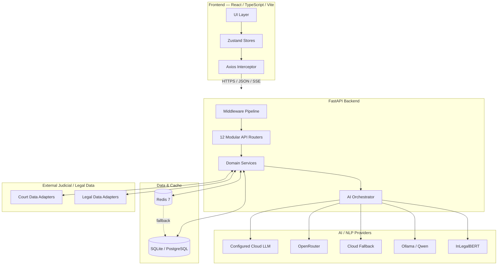
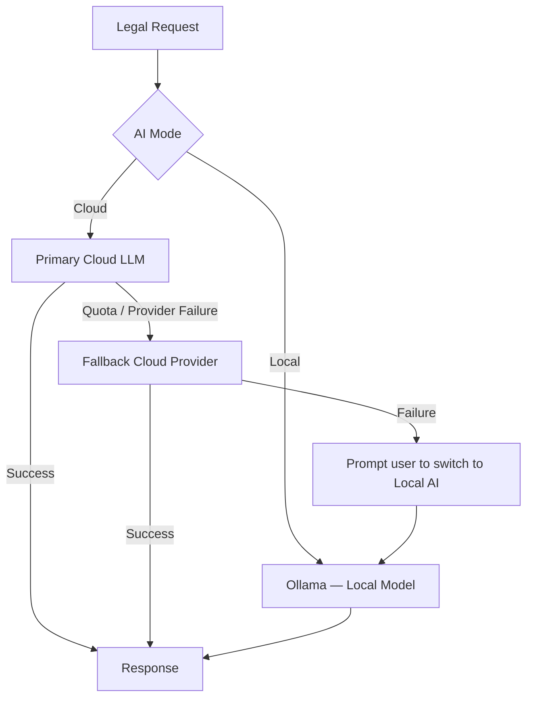

# ⚖️ SUITS — AI-Powered Court Intelligence & Legal Research Platform

<p align="center">
  <strong>AI-assisted court intelligence, legal research, precedent discovery, and drafting for the Indian Judicial Ecosystem.</strong>
</p>

<p align="center">
  
  
  
  
  
  
  
  
</p>

<p align="center">
  <a href="#-what-is-suits">What is SUITS?</a> •
  <a href="#-core-capabilities">Capabilities</a> •
  <a href="#-architecture">Architecture</a> •
  <a href="#-ai-engine">AI Engine</a> •
  <a href="#-quickstart">Quickstart</a> •
  <a href="#-responsible-use">Responsible Use</a>
</p>

---

## 🏛️ What is SUITS?

SUITS is an AI-powered Court Intelligence and Legal Research Platform designed around the workflows of advocates, legal researchers, clerks, and legal teams working with Indian judicial data.

The system brings together case and docket information, judgment analysis, precedent discovery, statutory-era analysis, document intelligence, legal drafting, and research workflows in one interface.

The design combines:

* **Deterministic legal logic** for parsing, classification, statutory mappings, and rule-based checks.
* **Domain-specific NLP** using `law-ai/InLegalBERT`.
* **Generative AI** for synthesis, explanations, drafting, and research assistance.
* **Hybrid retrieval** combining semantic similarity and citation relationships.
* **Local AI execution** through Ollama for workflows that should remain on the user's machine.
* **Asynchronous backend services** with caching and modular domain services.

> **SUITS is an assistive legal-research and drafting system. Its generated outputs require independent verification by a qualified legal professional before being relied upon or filed.**

---

## 🎬 Demo & Screenshots

<!-- Replace these placeholders with actual repository image paths before publishing. -->

### Case Intelligence Dashboard

<!-- Example:

-->

### Hybrid RAG & Citation Network

<!-- Example:

-->

### Legal Drafting & Defense Engine

<!-- Example:

-->

### Suggested Demo Flow

```text
CNR / Case Search
      ↓
Case Intelligence Dashboard
      ↓
Order & Judgment Analysis
      ↓
Precedent / Similar Case Discovery
      ↓
Citation Network
      ↓
Statutory Era Analysis
      ↓
AI Research / Drafting
      ↓
Legal Editor
```

---

## 🎯 Why SUITS?

Legal practitioners often have to move between fragmented court records, long judgments, statutory changes, precedent chains, case documents, and drafting tools.

SUITS is designed around that workflow rather than around a standalone chatbot.

### The core problems

| Problem                                 | SUITS approach                                                                              |
| --------------------------------------- | ------------------------------------------------------------------------------------------- |
| Fragmented case and docket information  | Unified case intelligence workflow with source-specific data adapters and caching           |
| Long, unstructured judgments            | Structured order intelligence and rhetorical-role-aware analysis                            |
| Difficult precedent research            | Hybrid RAG using semantic retrieval, domain-specific embeddings, and citation relationships |
| Criminal-law transition after July 2024 | BNS / BNSS / BSA era classification and curated concordance mappings                        |
| Paragraph-heavy defense drafting        | Deterministic paragraph extraction, bar detection, and AI-assisted traverses                |
| Sensitive legal documents               | Local AI mode through Ollama                                                                |
| Repetitive legal research               | Research vault, bookmarks, history, analytics, and contextual chatbot                       |

---

# 🧩 Core Capabilities

## 1. 🗂️ Case Intelligence Dashboard

A single workspace for case and docket intelligence.

* Search cases using CNR and supported case identifiers.
* Merge structured docket information with available judgment records.
* Build chronological case timelines.
* Classify case nature using deterministic taxonomy rules.
* Present intelligence through modular case cards.
* Cache frequently accessed case data for faster subsequent requests.

---

## 2. 📑 AI Order Intelligence

Transforms noisy legal documents into structured information.

The extraction pipeline can organize information such as:

* Case metadata
* Court and bench composition
* Parties and representation
* Operative directions and relief
* Statutes and sections
* Constitutional questions
* Precedents considered
* Client-oriented summaries

The goal is to turn a long judgment into a structured research object rather than only a block of text.

---

## 3. ⚖️ Judicial Outcome Analysis

SUITS includes an experimental AI-assisted outcome analysis workflow.

The system:

1. Generates a deterministic hash of relevant docket state.
2. Retrieves relevant precedent context.
3. Passes the case context to the configured reasoning model.
4. Produces an outcome-probability distribution with supporting rationale.
5. Caches the result until the underlying case state changes or the cache expires.

**Important:** these probabilities are model-generated analytical outputs, not guarantees or predictions of what a court will decide.

---

## 4. 🔄 BNS / BNSS / BSA Era Transition Analyzer

SUITS includes a dedicated statutory transition workflow for matters affected by the July 1, 2024 criminal-law transition.

The engine can distinguish:

* `LEGACY_IPC_ERA`
* `NEW_BNS_ERA`
* `HYBRID_TRANSITION_ERA`

It uses a curated concordance dataset for mappings such as:

```text
IPC   ↔ BNS
CrPC  ↔ BNSS
IEA   ↔ BSA
```

The system can also surface configured procedural-delta rules and generate transition-oriented drafting assistance.

---

## 5. 📰 Publisher-Style Headnote & Ratio Extraction

SUITS uses `law-ai/InLegalBERT` as part of its rhetorical-role analysis pipeline.

The workflow is designed to separate judicial reasoning from other portions of a judgment and produce structured research outputs including:

* Hierarchical catchwords
* Held points
* Ratio-oriented summaries
* Paragraph references
* Plain-language explanations

The generated material is intended as a research aid and should be checked against the source judgment.

---

## 6. 🔍 Hybrid RAG Precedent Discovery

Precedent retrieval combines multiple signals instead of relying on keyword search alone.

### Retrieval signals

1. **Citation relationships**

   * Cases cited by a judgment
   * Cases citing a judgment

2. **Dense semantic similarity**

   * Embedding-based retrieval

3. **Domain-specific legal embeddings**

   * `law-ai/InLegalBERT`
   * Whitened embedding space

These ranked results are combined using **Reciprocal Rank Fusion (RRF)**.

The system can then provide factual-nexus explanations to help a researcher inspect why a precedent was retrieved.

---

## 7. 🕸️ Interactive Citation Network

A D3-based force-directed graph visualizes relationships between judgments, courts, and legal authorities.

Features include:

* Cites / cited-by relationships
* Court-tier visualization
* Interactive nodes
* Graph-based exploration of precedent relationships
* Direct inspection of connected judgments

---

## 8. 🛡️ Adversarial Defense Engine

SUITS includes an AI-assisted workflow for preparing a Written Statement from an opposing pleading.

### Pipeline

```text
Plaint / Petition
      ↓
Paragraph extraction
      ↓
Paragraph classification
      ↓
Preliminary-bar detection
      ↓
Defense strategy selection
      ↓
AI-assisted traversal generation
      ↓
Written Statement assembly
      ↓
Legal Editor
```

The deterministic layer identifies numbered paragraphs and configured legal bars, while the generative layer assists with substantive denials.

---

## 9. 💬 Context-Aware Legal Research Chatbot

The chatbot can operate with active case context, including relevant case metadata and available research material.

The system supports:

* Multi-conversation workflows
* Server-Sent Events (SSE) streaming
* Case-aware context mounting
* Prompt constraints intended to reduce fabricated citations
* Explicit handling of uncertainty

---

## 10. 📝 Multi-Page Legal Drafting Editor

`LegalEditor.tsx` provides a browser-based A4 drafting experience.

Capabilities include:

* Multi-page A4 layout
* Page-aware content flow
* Legal document snippets
* Print-oriented styling
* PDF/print workflows
* DOCX-oriented export workflow
* Direct insertion of generated Written Statements

---

## 11. 📂 Document Intelligence

SUITS can ingest supported user documents and process them through a hybrid extraction pipeline.

### Pipeline

```text
PDF / DOCX / Image / Text
          ↓
Digital extraction or OCR
          ↓
Text normalization
          ↓
Recursive chunking
          ↓
Embedding generation
          ↓
Semantic search
```

The documented implementation uses tools such as `pdfplumber`, `python-docx`, and `pytesseract`.

---

## 12. 📊 Research Analytics & Workspace

The platform also includes workflow features for managing continuing legal research:

* Research vault
* Case bookmarks
* Case viewing history
* Search history
* Practice analytics
* 365-day activity heatmap
* Saved documents

---

# 📐 Architecture

SUITS follows a decoupled client-server architecture.



---

# 🔄 AI Engine

One of the main design principles of SUITS is that not every legal task is delegated directly to an LLM.

### Dual-mode routing



This allows SUITS to use cloud inference where appropriate while retaining a local execution path for supported workflows.

---

# 🧠 AI & Mathematical Foundations

## Rhetorical Role Segmentation

`InLegalBERT` is used for sentence-level legal-text analysis, helping the pipeline distinguish portions of a judgment according to rhetorical role.

The resulting signal can be used to focus downstream synthesis on judicial reasoning rather than treating the entire document identically.

## Whitening of Legal Embeddings

SUITS uses a precomputed whitening transformation for its InLegalBERT embeddings.

$$
v_{whitened} = (v_{raw} - \mu)W
$$

The resulting vectors are L2-normalized before similarity calculations.

This is intended to improve the usefulness of cosine similarity by reducing anisotropy in the embedding space.

## Reciprocal Rank Fusion

Multiple ranking signals can be merged using RRF:

$$
RRF(d)=\sum_{m \in M}\frac{1}{k+r_m(d)}
$$

where each retrieval method contributes according to its rank.

---

# 🧱 Backend Design

The backend is organized into modular layers.

```text
backend/
├── app/
│   ├── api/
│   │   ├── auth.py
│   │   ├── search.py
│   │   ├── cases.py
│   │   ├── orders.py
│   │   ├── chat.py
│   │   ├── bookmarks.py
│   │   ├── history.py
│   │   ├── analytics.py
│   │   ├── files.py
│   │   ├── documents.py
│   │   ├── statutes.py
│   │   └── counter_pleading.py
│   │
│   ├── clients/
│   ├── core/
│   ├── database/
│   ├── dependencies/
│   ├── middleware/
│   ├── models/
│   ├── prompts/
│   ├── repositories/
│   ├── schemas/
│   ├── services/
│   └── utils/
│
├── data/
├── tests/
├── pyproject.toml
└── suits.db
```

### Backend layers

| Layer        | Responsibility                                 |
| ------------ | ---------------------------------------------- |
| API routers  | HTTP endpoint controllers                      |
| Services     | Domain/business logic                          |
| Clients      | AI and external API adapters                   |
| Repositories | Data-access abstractions                       |
| Models       | SQLAlchemy persistence models                  |
| Schemas      | Pydantic request/response validation           |
| Middleware   | Provider routing, logging, rate limiting, CORS |
| Prompts      | Centralized AI prompt definitions              |

---

# 🗄️ Data Layer

### Development

* SQLite
* WAL mode
* Async SQLAlchemy
* Optional Redis cache

### Production target

* PostgreSQL
* Async SQLAlchemy
* Redis 7
* Horizontally scalable stateless API instances

### Two-tier cache

```text
Request
  ↓
Redis
  ├── HIT → return
  └── MISS
       ↓
Relational Store
  ├── HIT → populate Redis → return
  └── MISS
       ↓
External API / AI
       ↓
Persist → cache → return
```

---

# 📡 API

The backend exposes modular REST endpoints under `/api`.

Representative routes include:

| Area           | Example                    |
| -------------- | -------------------------- |
| Authentication | `/api/auth/...`            |
| Search         | `/api/search/...`          |
| Cases          | `/api/cases/{cnr}`         |
| Orders         | `/api/orders/{doc_id}/...` |
| Chat           | `/api/chat/...`            |
| Documents      | `/api/documents/...`       |
| Defense        | `/api/defense/...`         |
| Statutes       | `/api/statutes/...`        |
| Analytics      | `/api/analytics/...`       |
| Bookmarks      | `/api/bookmarks/...`       |
| History        | `/api/history/...`         |
| Saved files    | `/api/files/...`           |

Once the backend is running, interactive OpenAPI / Swagger documentation is available at:

```text
http://localhost:8000/docs
```

---

# 🛠️ Technology Stack

| Layer            | Technology                                       |
| ---------------- | ------------------------------------------------ |
| Frontend         | React 19.2, TypeScript, Vite 8.2, TailwindCSS v4 |
| State            | Zustand                                          |
| HTTP             | Axios                                            |
| Backend          | Python 3.12, FastAPI, Uvicorn                    |
| Validation       | Pydantic                                         |
| ORM              | SQLAlchemy 2.0 Async                             |
| Development DB   | SQLite                                           |
| Production DB    | PostgreSQL                                       |
| Cache            | Redis 7                                          |
| Legal NLP        | law-ai/InLegalBERT                               |
| Cloud AI         | Configured Gemini / OpenRouter / Groq clients    |
| Local AI         | Ollama + Qwen 2.5 7B                             |
| OCR              | Tesseract / pytesseract                          |
| Document parsing | pdfplumber / python-docx                         |
| Visualization    | D3                                               |
| Auth             | JWT + email OTP + Google OAuth flow              |

---

# 🚀 Quickstart

## Prerequisites

* Python 3.12+
* Node.js 20+
* Docker (for Redis, optional)
* Tesseract OCR for scanned-document processing

## 1. Clone

```bash
git clone https://github.com/<your-username>/<your-repository>.git
cd <your-repository>
```

## 2. Configure environment variables

Copy the backend environment template:

```bash
cp backend/.env.example backend/.env
```

Configure only the providers you intend to use.

Typical variables include:

```ini
DATABASE_URL=sqlite+aiosqlite:///./suits.db
REDIS_URL=redis://localhost:6379/0

JWT_SECRET=<generate-a-strong-secret>
JWT_REFRESH_SECRET=<generate-a-strong-refresh-secret>

ECOURTS_API_KEY=<your-key>

GEMINI_API_KEY=<your-key>
GEMINI_MODEL=gemini-3.5-flash

OPENROUTER_API_KEY=<your-key>
OPENROUTER_MODEL=openai/gpt-oss-120b

OLLAMA_BASE_URL=http://localhost:11434
OLLAMA_MODEL=qwen2.5:7b

RESEND_API_KEY=<your-key>
```

Never commit real credentials or `.env` files.

## 3. Start Redis

```bash
docker compose up -d
```

Redis is optional in the documented architecture because the application can fall back to relational persistence.

## 4. Start the backend

```bash
cd backend

python -m venv .venv
```

### Windows

```powershell
.\.venv\Scripts\Activate.ps1
```

### Linux / macOS

```bash
source .venv/bin/activate
```

Then:

```bash
pip install -e .
uvicorn app.main:app --reload --port 8000
```

Backend:

```text
http://localhost:8000
```

Swagger:

```text
http://localhost:8000/docs
```

## 5. Start the frontend

```bash
cd frontend
npm install
npm run dev
```

Frontend:

```text
http://localhost:5173
```

---

# 🧠 Optional: Local AI with Ollama

For supported workflows that should run locally:

```bash
ollama pull qwen2.5:7b
ollama serve
```

Then switch SUITS to:

```text
Settings → AI Mode → Local (Ollama)
```

The documented local endpoint is:

```text
http://localhost:11434
```

Local inference keeps the AI model execution on the user's machine, but overall privacy still depends on the rest of the deployment environment, storage configuration, source integrations, logging, and network setup.

---

# 🔐 Security & Authentication

SUITS includes:

* JWT access and refresh tokens
* Email verification using OTP
* Google OAuth flow
* Protected API dependencies
* Rate limiting
* CORS configuration
* Structured request logging
* User-scoped document storage
* Configurable local AI execution

Security-sensitive configuration is supplied through environment variables rather than source code.

---

# ⚠️ Responsible Use

SUITS is designed as an **assistive legal research and drafting system**, not as an autonomous legal decision-maker.

### Important limitations

* AI-generated content may contain factual, legal, or citation errors.
* Outcome probabilities are model outputs and should not be treated as guarantees.
* Headnotes, summaries, statutory mappings, and drafted pleadings should be checked against authoritative source material.
* OCR and document extraction can introduce errors.
* External data availability depends on the configured source and its API/service conditions.
* Local AI mode protects model inference locality, but does not automatically guarantee complete application-wide data isolation.
* Court filing requirements can vary by court, registry, case type, and current procedural rules; exported documents should be reviewed before filing.

**Do not rely on SUITS output as a substitute for professional legal judgment or authoritative legal sources.**

---

# ⚖️ Legal & Data References

The documented system incorporates workflows based on, among others:

* Constitution of India — including Article 141
* Bharatiya Nyaya Sanhita, 2023 (BNS)
* Bharatiya Nagarik Suraksha Sanhita, 2023 (BNSS)
* Bharatiya Sakshya Adhiniyam, 2023 (BSA)
* Code of Civil Procedure, 1908
* Commercial Courts Act, 2015
* Limitation Act, 1963

The system may also use external judicial/legal-data integrations through source-specific adapters.

**Use only data sources and APIs for which you have the appropriate authorization, access, and redistribution rights.**

---

# 📚 Research & Technical Foundations

SUITS builds on established technical work including:

* **InLegalBERT** — Indian legal-domain language modeling
* **Reciprocal Rank Fusion** — multi-ranking retrieval fusion
* **Sentence / rhetorical-role analysis** — for structured legal-text processing
* **Embedding whitening** — for improved representation geometry
* **D3 force-directed graphs** — for interactive citation-network visualization

The repository's deeper technical documentation can contain the full mathematical derivations, service-by-service implementation details, database schema, API inventory, sequence diagrams, deployment notes, and troubleshooting guide.

---

# 📖 Recommended Repository Documentation

For a maintainable public repository, keep the main README focused on the project and place the exhaustive reference material under `docs/`.

Suggested structure:

```text
docs/
├── architecture.md
├── ai-pipeline.md
├── features.md
├── api-reference.md
├── database.md
├── security.md
├── deployment.md
└── troubleshooting.md
```

---

# 📜 License

This project is licensed under the **MIT License**. See [`LICENSE`](LICENSE) for the complete license text.

---

<p align="center">
  Built as an exploration of AI-assisted legal intelligence, research workflows, and document automation for the Indian Judicial Ecosystem.
</p>
